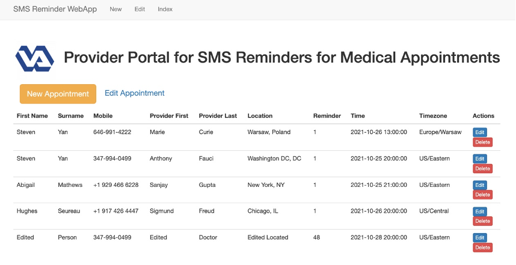
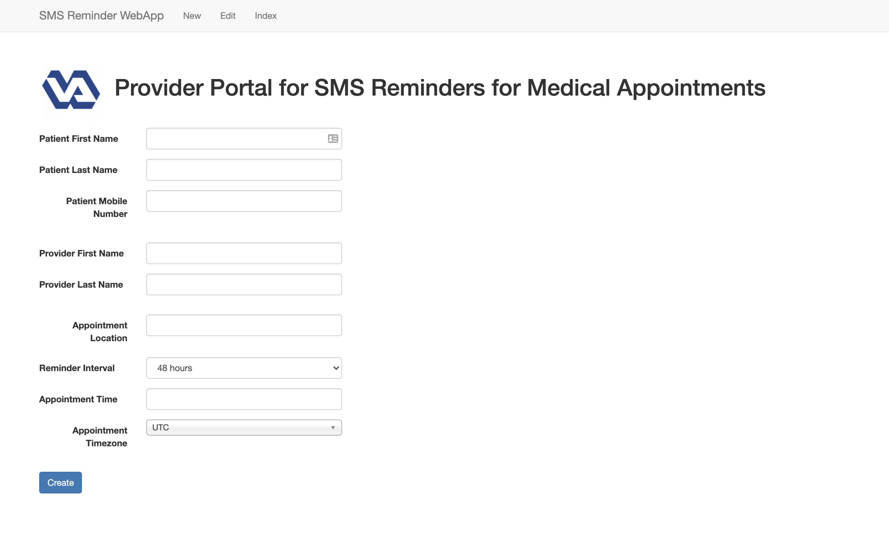

<h1>
SMS Medical Appointment Reminders WebApp 
by Steven Yan
</h1>

[https://youtu.be/tSKfUlj_sYA](https://youtu.be/tSKfUlj_sYA)

# Challenge:

**Here are the challenges presented from client:**

- Easily lose track of postcard reminders
- Manual entry of appointments into calendar
- Different levels of computer literacy for veterans

**Here are our proposed solutions:**

- Needs calendar integration (ICS universal for all phones)
- Develop webapp for provider
- Develop mobile app for patient
- Automated SMS reminder system for non-tech savvy veterans

# Solution:

**Provider End:**

- Develop web application to interact with hospital server to send and receive relevant informatio through APIs
- Without technical details from VA, we created an interfacce for manual entry of patient appointmnets using a SQLAlchemy database within Flask microframework
- Customize SMS reminders according to the following actions:
	- confirmed
	- rescheduled
	- modified
	- canceled
	- no showed

**Patient End:**

- Use Twilio platform to send and receive SMS messages
- Patients will receive an initial text after booking their appointment
- They will have capability to respond to SMS to receive ICS file for easy integration
	- Currently iPhone have capability to create calendar events from any SMS with time details, but Android requires additional software
- At a default of 48 hours prior, patient will receive second SMS reminder to confirm or cancel appointmnet
	- reminder time adjustable to different intervals

# Screenshots:

**Index Page:**

**New Appointment Page:**

**Sample SMS Reminders:**

# Presentation:

<!--<object data="docs/VA SMS Medical Appointment Reminder Platform.pdf" width="1000" height="1000" type='application/pdf'/></object>-->

# Folder Structure:

	├── README.md					<- top-level document for explaining project
	├── _app							<- folder of Flask application
	│   ├── _config					<- notebook for displaying augmentations
	│   ├── _forms					<- folder of forms scripts
	│   ├── _migrations			<- notebook for pretrained models
	│   ├── _models					<- folder of models script
	│   ├── _static					<- folder of CSS, Javascript, and image files
	│   ├── _templates				<- folder of HTML files
	│   ├── _views					<- folder of views script
	│   ├── application.py		<- script for defining routes and application
	│   ├── database.py			<- script for SQLAlchemy database
	│   ├── dev.sqlite				<- database file
	│   ├── Procfile				<- file for Heroku deployment
	│   ├── reminders.py			<- script for initiating application
	│   ├── requirements.txt		<- file for Heroku deployment
	│   └── tasks.py				<- script for running Celery tasks
	├── _docs							<- folder of project documentation
	└── _images						<- folder of jpeg and png files

# Contact Information:

